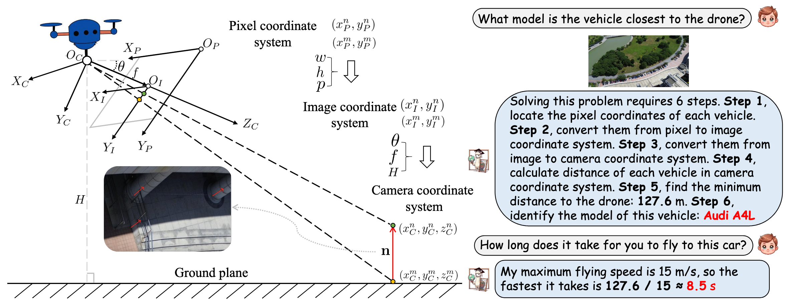
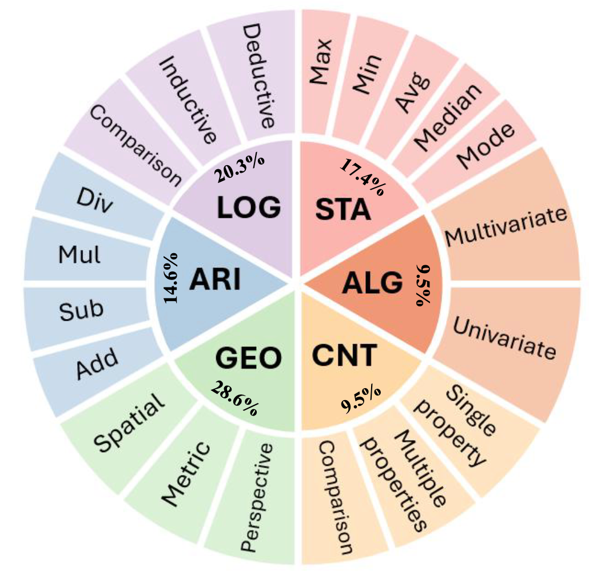

<div align="center">
<h1>Multimodal Mathematical Reasoning Embedded in Aerial Vehicle Imagery: Benchmarking, Analysis, and Exploration</h1>

<div>
    <a href='https://zytx121.github.io/' target='_blank'>Yue Zhou</a><sup>1,2</sup>&emsp;   
    <a href='https://scholar.google.com.hk/citations?user=PnNAAasAAAAJ&hl=en' target='_blank'>Litong Feng</a><sup>3</sup>&emsp;
    <a href='https://mc-lan.github.io/' target='_blank'>Mengcheng Lan</a><sup>2</sup>&emsp;
    <a href='https://yangxue.site/' target='_blank'>Xue Yang</a><sup>4</sup>&emsp;
    <a href='https://github.com/Li-Qingyun' target='_blank'>Qingyun Li</a><sup>5</sup>&emsp;
    <a href='https://keyiping.wixsite.com/index' target='_blank'>Yiping Ke</a><sup>2</sup>&emsp;
    <a href='https://ee.sjtu.edu.cn/FacultyDetail.aspx?id=53&infoid=66' target='_blank'>Jiang Xue</a><sup>4</sup>&emsp;
    <a href='https://www.statfe.com/' target='_blank'>Wayne Zhang</a><sup>3</sup>&emsp;
</div>
<div>
    <sup>1</sup>East China Normal University&emsp; 
    <sup>2</sup>Nanyang Technological University&emsp; 
    <sup>3</sup>SenseTime Research&emsp;
    <sup>4</sup>Shanghai Jiaotong University&emsp; 
    <sup>5</sup>Harbin Institute of Technology&emsp; 
</div>

[](https://xxx)
[](https://huggingface.co/datasets/erenzhou/avi-math)

</div>

<p align="center">
    
</p>

---

## 📢 Latest Updates

- **[2025.0x.xx]** We released the benchmark and evaluation code.
- **[2025.09.08]** Accepted by ISPRS JPRS.

---

## Abstract

*Mathematical reasoning is critical for tasks such as precise distance and area computations, trajectory estimations, and spatial analysis in unmanned aerial vehicle (UAV) based remote sensing, yet current vision-language models (VLMs) have not been adequately tested in this domain. To address this gap, we introduce \dataset, the first benchmark to rigorously evaluate multimodal mathematical reasoning in aerial vehicle imagery, moving beyond simple counting tasks to include domain-specific knowledge in areas such as geometry, logic, and algebra. The dataset comprises 3,773 high-quality vehicle-related questions captured from UAV views, covering 6 mathematical subjects and 20 topics. The data, collected at varying altitudes and from multiple UAV angles, reflects real-world UAV scenarios, ensuring the diversity and complexity of the constructed mathematical problems. In this paper, we benchmark 14 prominent VLMs through a comprehensive evaluation and demonstrate that, despite their success on previous multimodal benchmarks, these models struggle with the reasoning tasks in \dataset. Our detailed analysis highlights significant limitations in the mathematical reasoning capabilities of current VLMs and suggests avenues for future research. Furthermore, we explore the use of Chain-of-Thought prompting and fine-tuning techniques, which show promise in addressing the reasoning challenges in \dataset. Our findings not only expose the limitations of VLMs in mathematical reasoning but also offer valuable insights for advancing UAV-based trustworthy VLMs in real-world applications. *

<div align="center">
  
  <div style="display: inline-block; color: #999; padding: 2px;">
      Question types covered by AVI-Math. ARI: arithmetic, CNT: counting, ALG: algebra, STA: statistics, LOG: logic, GEO: geometry.
  </div>
</div>

---

## 🏆 Contributions

- **Benchmark.** We introduce AVI-Math, the first multimodal benchmark for mathematical reasoning in UAV imagery, covering six subjects and real-world UAV scenarios.

- **Analysis.**  We provide a comprehensive analysis, uncovering the limitations of current VLMs in mathematical reasoning and offering insights for future improvements.


- **Exploration.** We explore the potential of Chain-of-Thought prompting and fine-tuning techniques to enhance VLM performance, providing a 215k-sample instruction set for VLMs to learn domain-specific knowledge in UAV scenarios.

---

## 💬 AirSpatial Dataset

Word cloud visualizations of vehicle occurrence frequencies in our dataset. (a) shows the brand word cloud, where BYD ranks first. (b) illustrates the model word cloud, with Tesla Model 3 ranking first.
<p align="center">
  
</p>


---

## 🔍 Spatially-aware VLM

Visualizations of AirSpatialBot on AirSpatial-G with 3DBB. The green boxes indicate ground truth, while the red boxes represent predictions.

<p align="center">
  
</p>

---

## 🚀 Aerial Agent

Workflows for Vehicle Attribute Recognition, Zero-Shot Attribute Recognition and Target Retrieval Tasks.Planner

<div align="center">
  
</div>


## 📜 Citation
```bibtex
@ARTICLE{zhou2025airspatialbot,
  author={Zhou, Yue and Ding, Ran and Yang, Xue and Jiang, Xue and Liu, Xingzhao},
  journal={IEEE Transactions on Geoscience and Remote Sensing}, 
  title={AirSpatialBot: A Spatially-Aware Aerial Agent for Fine-Grained Vehicle Attribute Recognization and Retrieval}, 
  year={2025},
  volume={},
  number={},
  pages={1-1},
  doi={10.1109/TGRS.2025.3570895}
}
```
